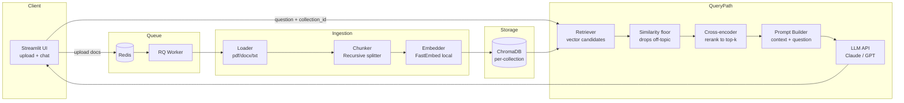

# RAG Generator

A runtime RAG (Retrieval-Augmented Generation) application: upload any set of
documents, get a grounded question-answering system over them — no code
changes required to switch document sets.

## Problem Statement

- Accepts documents at runtime
- Creates a RAG application over those documents
- Allows users to ask questions and receive grounded answers
- Works with different document sets without code changes

## Architecture



Uploads are enqueued to Redis and processed by an RQ worker, so ingesting a
large document doesn't block the UI thread — the user sees a "processing"
state and can query as soon as the job completes.

**Optional load balancer:** `docker-compose.lb.yml` runs 2 app replicas
behind Nginx with sticky sessions (`ip_hash`), since Streamlit holds session
state per instance and can't be load-balanced without pinning. This isn't
required for correctness at this scale — it's included to demonstrate
horizontal-scaling awareness. Run it instead of the base compose file if
you want to demo it:
```bash
docker compose -f docker-compose.lb.yml up --build
```
then open http://localhost:8080.

### Why this satisfies "no code changes across document sets"

Every uploaded batch of documents is embedded into its own **named ChromaDB
collection**, created dynamically at upload time. Nothing in the codebase
references a specific document, file path, or topic — the pipeline is generic
over whatever is uploaded. Switching to a new domain means uploading new
files and picking a new collection name in the UI, nothing else.

## Stack

| Layer | Choice | Why |
|---|---|---|
| Orchestration | LangChain | fast to wire chains together |
| Embeddings | FastEmbed (ONNX) | local, free, no API dependency |
| Vector store | ChromaDB (persistent, local) | zero-ops, per-collection isolation |
| Generation | Claude or GPT API (env-switchable) | grounded answer synthesis |
| UI | Streamlit | fastest path to a usable demo |

## Run it

### With Docker (recommended)
```bash
cp .env.example .env      # fill in your API key
docker compose up --build
```
Then open http://localhost:8501

The first build downloads the ML dependencies and takes a while; the UI and
the worker share one image (`rag-generator:local`) so it's only built once.

### Locally
```bash
python -m venv venv && source venv/bin/activate
pip install -r requirements.txt
cp .env.example .env      # fill in your API key
docker compose up -d redis   # the ingestion queue needs Redis
rq worker --url redis://localhost:6379 &   # in a second shell
streamlit run app/main.py
```

## Repo structure
```
rag-generator/
├── app/
│   ├── main.py          # Streamlit entrypoint
│   ├── ingestion.py      # document loading + chunking
│   ├── vectorstore.py    # Chroma collection management
│   ├── rag_chain.py       # retrieval + grounded generation
│   ├── jobs.py            # Redis/RQ ingestion queue
│   └── config.py
├── data/                  # sample documents for demoing (two unrelated sets)
├── tests/
├── transcripts/            # exported AI agent build transcript
├── Dockerfile
├── docker-compose.yml
└── requirements.txt
```

## Testing the "different document sets" requirement

`data/` ships two unrelated sample sets so you can demo a domain switch
without sourcing your own files. They are demo fixtures only — nothing in
`app/` references them (that's what `make no-hardcoded` enforces).

1. Upload document set A (e.g. the company handbook set), ask questions, note grounded answers with citations.
2. Upload document set B (an unrelated domain), ask questions — same app, zero code changes.
3. Ask a question with no answer in the context — the system should say it doesn't know rather than hallucinate.

## Agentic engineering practices used to build this

Three practices, each with a concrete artifact rather than just a claim:

| Practice | What it means here | Where |
|---|---|---|
| Spec-driven development | Acceptance criteria written as a testable contract before any code | [SPEC.md](SPEC.md) |
| Harness engineering | One command runs the automated portion of that contract, giving the agent fast pass/fail feedback instead of manual eyeballing | [Makefile](Makefile) (`make verify`) |
| Loop engineering | The agent iterates on `make verify` until green, with a bounded-retry rule so it escalates instead of looping forever on a stuck check | [CLAUDE.md](CLAUDE.md) |

Git history is part of the evidence, not just the code: each commit maps
to one requirement in SPEC.md and only happens once `make verify` passes
for that piece (`git log --oneline` shows this directly). CI
([.github/workflows/verify.yml](.github/workflows/verify.yml)) runs the
fast checks — tests, lint, the hardcoded-reference check — on every push;
the docker smoke test stays local since it needs a real API key to boot.

## Notes / trade-offs

- Embeddings run locally to avoid an extra API dependency and cost; generation still needs one LLM API key.
- Chunking targets 800 chars with 100 overlap (`CHUNK_SIZE` / `CHUNK_OVERLAP`), but the target is a soft guide: splits land on paragraph then sentence boundaries, and only fall back to a space or raw cut when a single sentence is oversized (SPEC.md FR8). A production version would tune per document type or use semantic chunking.
- Retrieval is two-stage: a wide vector fetch (`RERANK_FETCH_K`, default 20)
  narrowed to `TOP_K` by a local cross-encoder rerank
  (`Xenova/ms-marco-MiniLM-L-6-v2`, ONNX, no API key). Vector distance alone
  is a coarse relevance signal; the cross-encoder reads query and chunk
  together and discriminates far better. Set `RERANK_ENABLED=false` to fall
  back to plain top-k.
- Two relevance gates sit in front of generation, both off-by-default-ish and
  tunable, because the right cut-off is corpus- and model-specific:
  | Gate | Default | Measured on the sample corpus |
  |---|---|---|
  | `SIMILARITY_THRESHOLD` (cosine, 0-1) | `0.2` | on-topic ≈ 0.65-0.70, off-topic ≈ 0.40-0.50 — so 0.2 catches only true garbage, deliberately, since this gate runs *before* reranking and a high value starves it |
  | `RERANK_SCORE_THRESHOLD` (raw logit) | blank (off) | on-topic ≈ -3.5, off-topic ≈ -11 — much sharper separation; enable once calibrated on your own documents |

  Collections are created with cosine distance (`hnsw:space`) so these scores
  stay on a consistent scale across embedding models — Chroma's l2 default
  scored a correct match at 0.03 in testing, which no fixed threshold can use.
- The final "I don't know" is still enforced in the prompt (SPEC.md FR6): the
  thresholds cheaply refuse obvious misses before spending an LLM call, but
  the model remains the backstop for context that's retrieved yet unhelpful.
- No auth/multi-tenancy — out of scope for this exercise but noted as a next step.
- No PR/branch workflow or pre-commit hook framework — for a solo, timeboxed
  build these add process overhead without much signal; commit-level
  discipline (see above) covers the same intent more cheaply.
