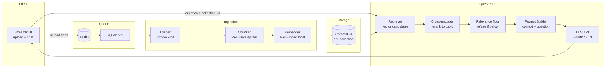

# RAG Generator

A runtime RAG (Retrieval-Augmented Generation) application: upload any set of
documents, get a grounded question-answering system over them — no code
changes required to switch document sets.

## Problem Statement

- Accepts documents at runtime
- Creates a RAG application over those documents
- Allows users to ask questions and receive grounded answers
- Works with different document sets without code changes

## Architecture



Uploads are enqueued to Redis and processed by an RQ worker, so ingesting a
large document doesn't block the UI thread — the user sees a "processing"
state and can query as soon as the job completes.

**Optional load balancer:** `docker-compose.lb.yml` runs 2 app replicas
behind Nginx with sticky sessions (`ip_hash`), since Streamlit holds session
state per instance and can't be load-balanced without pinning. This isn't
required for correctness at this scale — it's included to demonstrate
horizontal-scaling awareness. Run it instead of the base compose file if
you want to demo it:
```bash
docker compose -f docker-compose.lb.yml up --build
```
then open http://localhost:8080.

### Why this satisfies "no code changes across document sets"

Every uploaded batch of documents is embedded into its own **named ChromaDB
collection**, created dynamically at upload time. Nothing in the codebase
references a specific document, file path, or topic — the pipeline is generic
over whatever is uploaded. Switching to a new domain means uploading new
files and picking a new collection name in the UI, nothing else.

## Stack

| Layer | Choice | Why |
|---|---|---|
| Orchestration | LangChain | fast to wire chains together |
| Embeddings | FastEmbed (ONNX) | local, free, no API dependency |
| Vector store | ChromaDB (persistent, local) | zero-ops, per-collection isolation |
| Generation | Claude or GPT API (env-switchable) | grounded answer synthesis |
| UI | Streamlit | fastest path to a usable demo |

## Run it

### With Docker (recommended)
```bash
cp .env.example .env      # fill in your API key
docker compose up --build
```
Then open http://localhost:8501

The first build downloads the ML dependencies and takes a while; the UI and
the worker share one image (`rag-generator:local`) so it's only built once.

### Locally
```bash
python -m venv venv && source venv/bin/activate
pip install -r requirements.txt
cp .env.example .env      # fill in your API key
docker compose up -d redis   # the ingestion queue needs Redis
rq worker --url redis://localhost:6379 &   # in a second shell
streamlit run app/main.py
```

## Repo structure
```
rag-generator/
├── app/
│   ├── main.py             # Streamlit entrypoint
│   ├── ingestion.py        # document loading + chunking
│   ├── vectorstore.py      # Chroma collection management
│   ├── rag_chain.py        # retrieval + grounded generation
│   ├── jobs.py             # Redis/RQ ingestion queue
│   └── config.py
├── eval/
│   ├── run_eval.py         # NFR4 answer-quality harness (RAGAS)
│   ├── eval_set.json       # questions written against the sample docs
│   └── RESULTS.md          # generated scores - see Evaluation above
├── data/                   # sample documents for demoing (two unrelated sets)
├── tests/
├── transcripts/            # exported AI agent build transcript
├── .github/workflows/      # CI: test, lint, no-hardcoded, no-heavy-deps
├── Makefile                # make verify - the harness (see above)
├── Dockerfile
├── docker-compose.yml
└── requirements.txt
```

## Testing the "different document sets" requirement

`data/` ships two unrelated sample sets so you can demo a domain switch
without sourcing your own files. They are demo fixtures only — nothing in
`app/` references them (that's what `make no-hardcoded` enforces).

1. Upload document set A (e.g. the company handbook set), ask questions, note grounded answers with citations.
2. Upload document set B (an unrelated domain), ask questions — same app, zero code changes.
3. Ask a question with no answer in the context — the system should say it doesn't know rather than hallucinate.

## Evaluation

`make verify` proves the *mechanism* works — retrieval feeds the prompt,
citations are attached, the threshold refuses. It says nothing about whether
the answers are actually right. [`eval/RESULTS.md`](eval/RESULTS.md) covers
that: a hand-written set of questions
([`eval/eval_set.json`](eval/eval_set.json)) written against what the sample
documents genuinely say, run through the real query path against the real
configured LLM.

Two independent signals per answerable question, not one conflated pass/fail:
**retrieval-hit** (did the expected source file actually come back in the
top-k) and **answer-correctness** (does the answer contain the expected
facts). Off-domain questions are graded on whether the system refused. On top
of that, [RAGAS](https://github.com/vibrantlabsai/ragas) scores the same run
with an LLM-as-judge — using the app's own configured model and FastEmbed
embeddings, not RAGAS's defaults, so the scores describe the stack actually
being shipped:

| Metric | Needs a reference answer? | Covers |
|---|---|---|
| `faithfulness`, `answer_relevancy` | no | every answered row |
| `context_precision`, `context_recall`, `answer_correctness` | yes | rows with an optional `reference_answer` |

`should_refuse` rows are skipped entirely — there's no answer for a judge to
read — and keep the refusal check instead.

Regenerate with `make eval` — it needs a live API key and spends tokens
(RAGAS meaningfully more, since each metric is its own judge call per row),
which is why none of this is part of `make verify`.

## Agentic engineering practices used to build this

Three practices, each with a concrete artifact rather than just a claim:

| Practice | What it means here | Where |
|---|---|---|
| Spec-driven development | Acceptance criteria written as a testable contract before any code | [SPEC.md](SPEC.md) |
| Harness engineering | One command runs the automated portion of that contract, giving the agent fast pass/fail feedback instead of manual eyeballing | [Makefile](Makefile) (`make verify`) |
| Loop engineering | The agent iterates on `make verify` until green, with a bounded-retry rule so it escalates instead of looping forever on a stuck check | [CLAUDE.md](CLAUDE.md) |

Git history is part of the evidence, not just the code: each commit maps
to one requirement in SPEC.md and only happens once `make verify` passes
for that piece (`git log --oneline` shows this directly). CI
([.github/workflows/verify.yml](.github/workflows/verify.yml)) runs the
fast checks — tests, lint, the hardcoded-reference check — on every push;
the docker smoke test stays local since it needs a real API key to boot.

## Notes / trade-offs

- Embeddings run locally to avoid an extra API dependency and cost; generation still needs one LLM API key.
- Chunking targets 800 chars with 100 overlap (`CHUNK_SIZE` / `CHUNK_OVERLAP`), but the target is a soft guide: splits land on paragraph then sentence boundaries, and only fall back to a space or raw cut when a single sentence is oversized (SPEC.md FR8). A production version would tune per document type or use semantic chunking.
- Retrieval is two-stage: a wide vector fetch (`RERANK_FETCH_K`, default 20)
  narrowed to `TOP_K` by a local cross-encoder rerank
  (`Xenova/ms-marco-MiniLM-L-6-v2`, ONNX via FastEmbed, no API key). Vector
  distance alone is a coarse relevance signal; the cross-encoder reads query
  and chunk together and discriminates far better. `make no-heavy-deps` keeps
  a PyTorch-backed reranker (multi-GB) from creeping into the image. Set
  `RERANK_ENABLED=false` to fall back to plain top-k.
- `SIMILARITY_THRESHOLD` (default `-8.0`) is the relevance floor behind FR6's
  refusal: if the best chunk the reranker can find scores below it, the
  question is refused without an LLM call. The value is a raw cross-encoder
  logit, calibrated by measurement against the sample corpus:

  | | top rerank score |
  |---|---|
  | on-topic questions ("core working hours", "how do I apply for leave") | -4.9 to +5.8 |
  | off-topic questions ("who is Donald Trump", "delta-v for a lunar transfer") | -11.4 to -11.0 |

  `-8.0` sits mid-gap with margin either side. Recalibrate if you change
  `RERANK_MODEL` — the scale is model-specific.
- The prompt-level "I don't know" instruction stays as the backstop (SPEC.md
  FR6): the threshold refuses obvious misses cheaply, but the model still
  handles context that is retrieved and on-topic yet doesn't actually contain
  the answer.
- The eval set is still small and hand-written (14 questions) — enough to
  exercise every requirement, not enough to be a statistically confident
  quality benchmark.
- `answer_correctness` is scored against a deliberately one-sentence
  `reference_answer`, which penalises answers that are correct *and* add
  further true detail from the documents — the extra claims have nothing in
  the reference to match. The low scores in `eval/RESULTS.md` are that, not
  wrong answers, and are left rather than padded until the number flatters.
  `faithfulness` is the metric that would actually catch an unsupported claim.
- `ragas==0.2.15` is pinned in `requirements.txt` because newer releases pull
  an unconstrained `langchain` that pip resolves to a `langchain-core` past
  what `langchain-anthropic==0.3.0` allows — recheck compatibility before
  bumping either. Installed with no extras, so it brings no torch/CUDA
  (NFR5); `make no-heavy-deps` enforces that.
- No auth/multi-tenancy — out of scope for this exercise but noted as a next step.
- No PR/branch workflow or pre-commit hook framework — for a solo, timeboxed
  build these add process overhead without much signal; commit-level
  discipline (see above) covers the same intent more cheaply.

## Known limitations

Found during a completion audit and left in place deliberately — each is
recorded here rather than papered over.

- **`docker-smoke` can validate an already-running container.** If the
  rebuilt image is layer-identical to one already up, `docker compose up
  --build` leaves the existing containers running and the health check hits
  those rather than a genuinely fresh boot. NFR1 is confirmed independently
  by a real clean-clone test (`git clone` to a temp directory, then
  `docker compose up --build` as its own compose project), which is where
  that guarantee actually comes from.
- **`make verify` stops any running dev stack.** `docker-smoke` ends in
  `docker compose down`, and the compose services use
  `restart: unless-stopped`, so running verify against a live demo session
  will take it down. Expected given what the target is for, but worth
  knowing before running it mid-demo.
- **FR3's processing state needs a manual "Refresh status" click.** The UI
  shows `queued…`/`started…`/`N chunks indexed`, but does not poll — the
  state only advances when the button is pressed. A real fix means either a
  polling loop or a component like `streamlit-autorefresh`, and neither is a
  new moving part worth introducing this late.
