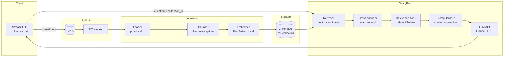

# Architecture

How the pieces fit together, and why they're split this way. For what
each piece actually does line-by-line, see [COMPONENTS.md](COMPONENTS.md).
For the acceptance criteria this architecture is built to satisfy, see
[../SPEC.md](../SPEC.md).

## Diagram

Two independent paths share one vector store: an **ingestion path** (top,
runs on the worker, off the request thread) and a **query path** (bottom,
runs on the UI thread, blocking only for the duration of one question).
Nothing in either path is specific to a document domain — that's what
lets FR7 ("new domain, zero code changes") hold.

## Why split this way

**Ingestion is async, query is sync.** Embedding a large document set can
take seconds to minutes; blocking the UI thread on it would make the app
feel broken. So uploads go through Redis/RQ (FR3) and the UI just polls a
job id. Querying, by contrast, is a single request-response the user is
actively waiting on — no queue needed, just a direct call.

**Collections are the isolation boundary, not separate app instances.**
Every uploaded batch gets its own named ChromaDB collection (FR2).
Switching domains is choosing a different collection name at query time,
not deploying different code or config (FR7) — this is the single
architectural decision that makes the "no code changes across document
sets" requirement true, and it's why `app/` fails `make no-hardcoded` the
moment any module mentions a real filename or topic.

**Retrieval is two-stage, not one.** A wide, cheap vector search
(`RERANK_FETCH_K` candidates) gets narrowed to `TOP_K` by a local
cross-encoder that reads the query and each candidate together (FR9).
Vector similarity alone is a coarse proxy for relevance; the cross-encoder
is slower per-candidate but far more discriminating, so it's only run on
the shortlist, not the whole collection.

**The refusal gate sits before the LLM call, not inside the prompt.**
FR6 is enforced by a numeric threshold on the reranked candidates' top
score (`SIMILARITY_THRESHOLD`) — if nothing clears it, the app returns the
fixed refusal string and never calls the LLM. The prompt also instructs
the model to refuse when context doesn't answer the question, but that's
a second line of defense: a number comparison can't be talked out of its
answer the way a model's instruction-following sometimes can. This is why
the gate lives in `vectorstore.similarity_search` (which returns nothing
when the gate fails) rather than in `rag_chain`'s prompt text alone.

**Everything content-bearing runs locally; only generation calls out.**
Embeddings (FastEmbed) and reranking (a FastEmbed cross-encoder) both run
as local ONNX models — no API key, no per-chunk cost, and no torch/CUDA
dependency (NFR5). Only the final answer-generation step calls an external
LLM API (Anthropic or OpenAI, switched by `LLM_PROVIDER`), and only after
the relevance gate has already decided the question is answerable — so a
fully off-topic question never spends a token on generation.

## Data at rest

- **ChromaDB** (`CHROMA_PERSIST_DIR`, default `./chroma_store`): one
  collection per uploaded document set. Persistent on disk so collections
  survive a container restart.
- **Redis**: transient job queue and job-result storage (RQ's bookkeeping)
  — not a source of truth for anything; safe to lose on restart, uploads
  just need to be redone.

## Deployment shape

`docker-compose.yml` runs three containers from one image
(`rag-generator:local`): the Streamlit app, the RQ worker, and Redis. The
optional `docker-compose.lb.yml` runs two app replicas behind Nginx with
sticky sessions, since Streamlit keeps session state per instance — see
the README for when that's worth demoing. Neither compose file touches
the worker's scaling story: adding a second `rag-worker` replica is just
adding a service block, since jobs are pulled from a shared Redis queue.
